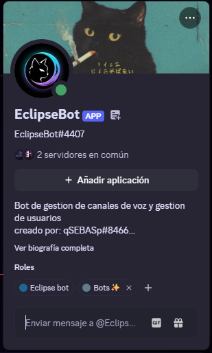

# 🌒 EclipseBot - Discord Automation

<p align="center">
  
  
  
  
</p>

<p align="center">
  <strong>Un bot de Discord diseñado para la automatización, administración y utilidad del servidor.</strong>
</p>

---

## 🚀 Descripción del Proyecto

EclipseBot es una herramienta integral desarrollada para mejorar la experiencia de usuario y simplificar la gestión de comunidades en Discord. Su objetivo principal es automatizar tareas repetitivas de moderación, proporcionar herramientas útiles a los usuarios y facilitar la administración del servidor mediante comandos intuitivos.

<p align="center">
  
</p>L

## ✨ Características Principales

* 🛡️ **Moderación Automatizada:** Comandos de ban, kick, mute, y limpieza de mensajes.
* 🛠️ **Herramientas Administrativas:** Configuración rápida del servidor y gestión de roles.
* ⚙️ **Utilidades de Usuario:** Comandos informativos y de entretenimiento (como `/ping`, info de usuario).
* 🌐 **Sistema de Cogs:** Arquitectura modular para añadir nuevas funciones fácilmente.
* 💾 **Persistencia (Si aplica):** Uso de base de datos para configuraciones personalizadas.

## 🎓 ¿Qué Aprendí y Qué Habilidades Desarrollé?

Este proyecto ha sido fundamental en mi crecimiento como desarrollador empírico. No solo construí un producto funcional, sino que superé desafíos técnicos que fortalecieron mis conocimientos en:

| Habilidad Técnica Desarrollada | Descripción del Aprendizaje |
| :--- | :--- |
| **🐍 Programación Asíncrona (Python `asyncio`)** | Aprendí a manejar múltiples eventos simultáneos sin bloquear la ejecución del bot. Entendí el uso de `async` y `await`, crucial para APIs de red. |
| **🌐 Integración con APIs Complexas** | Aprendí a interactuar y entender la API de Discord a través de la librería `discord.py`, manejando eventos y respuestas en tiempo real. |
| **🧩 Arquitectura Modular (Cogs)** | Implementé un sistema de "Cogs" en el bot, lo que me enseñó a organizar el código en módulos independientes y reutilizables, facilitando el mantenimiento y la escalabilidad. |
| **🛡️ Gestión de Seguridad y Permisos** | Desarrollé lógica para verificar roles y permisos de usuario antes de ejecutar comandos críticos de moderación, un concepto clave en el desarrollo web. |
| **🔧 Resolución de Problemas y Depuración** | Enfrenté errores de red, límites de tasa de la API y bugs lógicos que me ayudaron a mejorar mis habilidades de debugging y a leer documentación técnica. |

## 🛠️ Stack Tecnológico

* **Lenguaje:** Python
* **Librería Principal:** `discord.py`
* **Librerías Adicionales:** [MENCIONA_AQUÍ, p.ej., `dotenv`, `sqlalchemy`]
* **Persistencia (Si aplica):** [P.ej., SQLite]

## 📥 Instalación

### Prerrequisitos

* Python 3.8 o superior instalado.
* Un token de bot de Discord ([Crea uno aquí](https://discord.com/developers/applications)).

### Pasos

1.  **Clonar el repositorio:**
    ```bash
    git clone [https://github.com/qSEBASp/EclipseBot-Discord.git](https://github.com/qSEBASp/EclipseBot-Discord.git)
    cd EclipseBot-Discord
    ```

2.  **Instalar dependencias:**
    ```bash
    pip install -r requirements.txt
    ```

3.  **Configuración (.env):**
    * Crea un archivo llamado `.env` en la raíz del proyecto.
    * Añade tu token de Discord: `DISCORD_TOKEN=tu_token_aqui_sin_comillas`.

4.  **Ejecutar el bot:**
    ```bash
    python main.py
    ```

## 👨‍💻 Autor

Este proyecto fue desarrollado por:

**Sebastian Quiqui Fonque**
* [@qSEBASp en GitHub](https://github.com/qSEBASp)
* [Perfil de LinkedIn](https://www.linkedin.com/in/sebas-quiqui-dev/)
* [sebasfonque@gmail.com](mailto:sebasfonque@gmail.com)

---
*Este proyecto es parte de mi portafolio como desarrollador Junior Frontend (con habilidades de Backend) autodidacta.*
